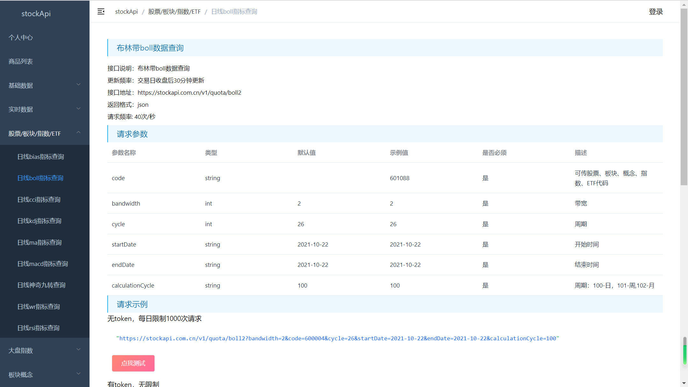
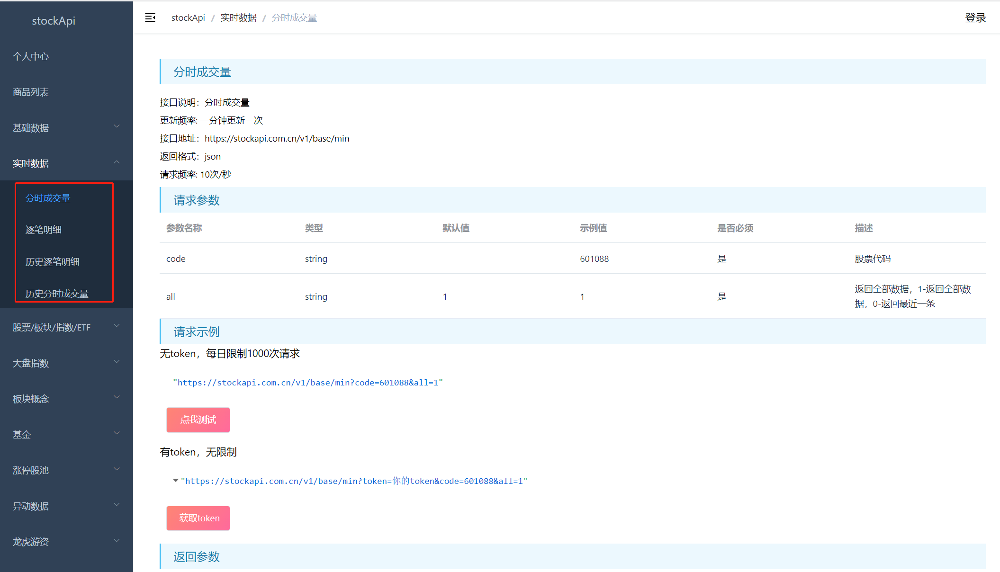
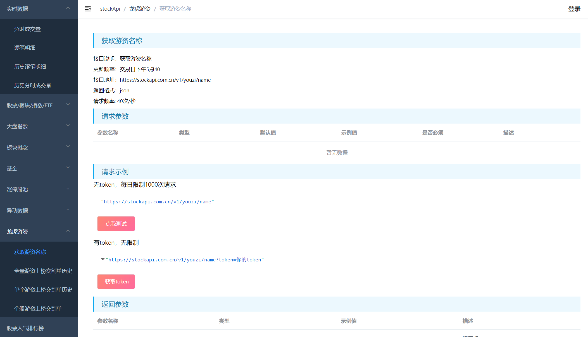
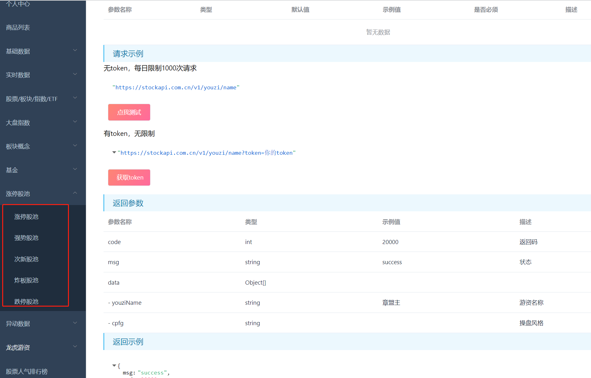

stockapi提供股票数据接口api，有基础数据，实时数据，指标数据，包含股票，指数，板块，概念，ETF，龙虎榜数据，游资数据，股票排行榜，涨停池，跌停池，炸板池等常用的数据，地址：https://stockapi.com.cn
### 指标包括：
macd，kdj，boll，cci，wr，rsi，bias，神奇九转指标等等

### 实时数据包括：
逐笔成交数据，分时成交量数据，历史逐笔成交数据，历史分时成交量数据

### 游资交割单数据

### 涨停池数据：

更多数据请登录系统：https://stockapi.com.cn 查看